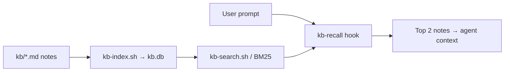
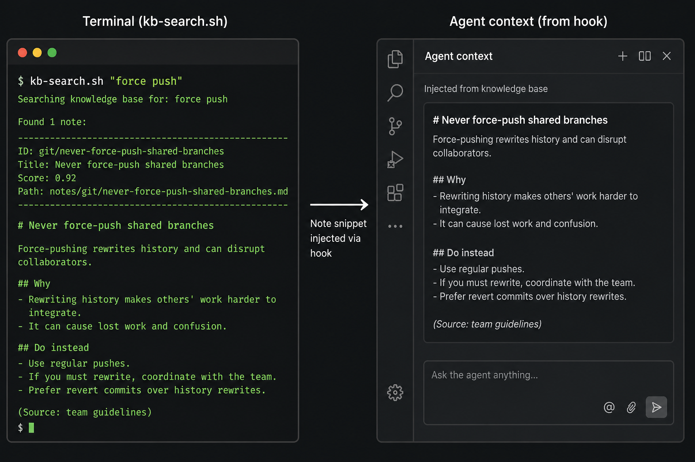

# agent-knowledge

Lightweight **tool-agnostic** memory for AI agents: markdown in `kb/`, search via local **SQLite FTS5**
(one `kb.db` file, no daemons, BM25, rebuild in under a second). No Elasticsearch, no vectors —
for a few hundred notes that's the sweet spot between cost and quality.

## Why

Every Cursor / Claude Code session shouldn't start from scratch. Rules, decisions, and gotchas pile up
and get injected through hooks (top 2 relevant facts per prompt).

## How it works





1. You write facts in `kb/` (or capture after a task).
2. `kb-index.sh` builds a local FTS index (`kb.db`).
3. On each prompt, `kb-recall.sh` searches and injects the best matches.

## Quick start

```bash
# 1. Clone and copy into your repo root (or use as a submodule)
git clone https://github.com/gohaisee/agent-knowledge.git /tmp/agent-knowledge
cp -R /tmp/agent-knowledge/. ./.knowledge/

# 2. Build the index
.knowledge/bin/kb-index.sh

# 3. Search
.knowledge/bin/kb-search.sh "how to deploy"

# 4. Add a note
echo "The actual insight" | .knowledge/bin/kb-capture.sh rules no-force-push "Never force push" git

# 5. Wire hooks: see setup/SETUP.md and examples/cursor/hooks.json
```

Dependencies: `python3`, `sqlite3`, `jq`, `rg` (ripgrep). Check with `setup/install.sh` (macOS: `--install` via Homebrew).

## Layout

| Path | What |
|------|------|
| `GOVERNANCE.md` | The constitution — **read this first** |
| `kb/` | Source of truth. One fact = one md file + YAML frontmatter |
| `kb/_TEMPLATE.md` | Note template |
| `bin/kb-index.sh` | Build `kb.db` from `kb/` |
| `bin/kb-search.sh` | Search (FTS5 BM25, ripgrep fallback) |
| `bin/kb-capture.sh` | Add a note and rebuild the index |
| `bin/kb-dont-repeat.sh` | Session exit "don't repeat" (mistakes + optional triage) |
| `bin/kb-doctor.sh` | Health report: duplicates, category skew |
| `hooks/` | Recall + session start/end for Cursor/Claude |
| `examples/` | Sample hooks.json and Cursor rule |
| `kb.db` | Index artifact (in `.gitignore`) |

`kb/` categories: `rules` · `preferences` · `best-practices` · `anti-patterns` ·
`architecture` · `business-logic` · `errors` · `code-reviews` · `playbooks`.

Demo notes (`kb/rules/git-no-force-push.md`, `kb/architecture/system.md`, `kb/errors/upstream-timeout.md`) show what real entries look like.

## Testing

```bash
tests/run.sh
```

Covers index build, BM25 search, capture + duplicate guard, and `kb/` frontmatter checks. CI runs the same on every push.

## Claude memory (optional)

Index `~/.claude/projects/<slug>/memory/*.md`:

```bash
export KB_MEMORY_DIR="$HOME/.claude/projects/-Users-you-myproject/memory"
bin/kb-index.sh
```

## Component stubs

For recall when a component name shows up in the prompt — a note with heading `# Stub: my-service`
in `kb/architecture/stubs/`. The `kb-recall.sh` hook pulls it when the name appears in the request.

## Contributing

See `CONTRIBUTING.md`.

## License

MIT — see `LICENSE`.

## Origin

Extracted from an internal `.knowledge` setup (SQLite FTS5, not pgvector RAG).
Skeleton only — no private notes. Fill `kb/` with your own project.
