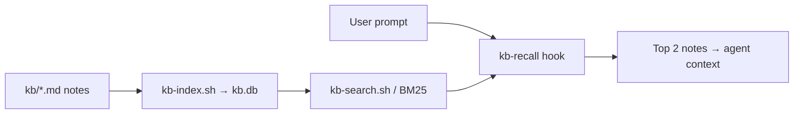

# agent-knowledge

[](https://github.com/gohaisee/agent-knowledge/actions/workflows/ci.yml)
[](LICENSE)

**Agent memory that stays on your machine** — markdown notes, local SQLite search, hooks that inject context into Cursor or Claude. No cloud, no vectors, no daemon.

Lightweight **tool-agnostic** memory for AI agents: markdown in `kb/`, search via **SQLite FTS5**
(one `kb.db` file, BM25, rebuild in under a second). For hundreds of notes that's the sweet spot between cost and quality.

## Why

Every agent session shouldn't start from scratch. Rules, decisions, and gotchas pile up
and get injected through hooks (top 2 relevant facts per prompt).

## How it works




1. You write facts in `kb/` (or capture after a task).
2. `kb-index.sh` builds a local FTS index (`kb.db`).
3. On each prompt, `kb-recall.sh` searches and injects the best matches.

## Quick start

```bash
git clone https://github.com/gohaisee/agent-knowledge.git /tmp/agent-knowledge
cp -R /tmp/agent-knowledge/. ./.knowledge/
.knowledge/setup/install.sh
.knowledge/bin/kb-index.sh
.knowledge/bin/kb-search.sh "force push"
```

**Wire into your editor:** [Cursor walkthrough](examples/cursor/WALKTHROUGH.md) · [Claude Code walkthrough](examples/claude/WALKTHROUGH.md)

```bash
# Add a note after you learn something new
echo "The actual insight" | .knowledge/bin/kb-capture.sh rules my-slug "Short title" tag1
.knowledge/bin/kb-validate.sh
```

Dependencies: `python3`, `sqlite3`, `jq`, `rg`. Check with `setup/install.sh` (macOS: `--install` via Homebrew).

## Layout

| Path | What |
|------|------|
| `GOVERNANCE.md` | The constitution — **read this first** |
| `kb/` | Source of truth. One fact = one md file + YAML frontmatter |
| `kb/_TEMPLATE.md` | Note template |
| `bin/kb-index.sh` | Build `kb.db` from `kb/` |
| `bin/kb-search.sh` | Search (FTS5 BM25, ripgrep fallback) |
| `bin/kb-capture.sh` | Add a note and rebuild the index |
| `bin/kb-validate.sh` | Lint notes (ids, frontmatter, min body) |
| `bin/kb-dont-repeat.sh` | Session exit "don't repeat" (mistakes + optional triage) |
| `bin/kb-doctor.sh` | Health report: duplicates, category skew |
| `hooks/` | Recall + session start/end for Cursor/Claude |
| `examples/` | Walkthroughs, hooks.json, Cursor rule |
| `kb.db` | Index artifact (in `.gitignore`) |

`kb/` categories: `rules` · `preferences` · `best-practices` · `anti-patterns` ·
`architecture` · `business-logic` · `errors` · `code-reviews` · `playbooks`.

Demo notes (`kb/rules/git-no-force-push.md`, `kb/architecture/system-overview.md`, `kb/errors/upstream-timeout.md`) show what real entries look like.

## Testing

```bash
tests/run.sh        # integration + validate
tests/perf_smoke.sh # 1000-note index smoke (optional)
```

CI runs shellcheck, integration tests, validate, and perf smoke on every push.

## Claude memory (optional)

Index `~/.claude/projects/<slug>/memory/*.md`:

```bash
export KB_MEMORY_DIR="$HOME/.claude/projects/-Users-you-myproject/memory"
bin/kb-index.sh
```

## Component stubs

For recall when a component name shows up in the prompt — a note with heading `# Stub: my-service`
in `kb/architecture/stubs/`. The `kb-recall.sh` hook pulls it when the name appears in the request.

## Contributing

See `CONTRIBUTING.md`. Bug reports and ideas welcome via GitHub Issues.

## License

MIT — see `LICENSE`.

## Origin

Extracted from an internal `.knowledge` setup (SQLite FTS5, not pgvector RAG).
Skeleton only — no private notes. Fill `kb/` with your own project.
